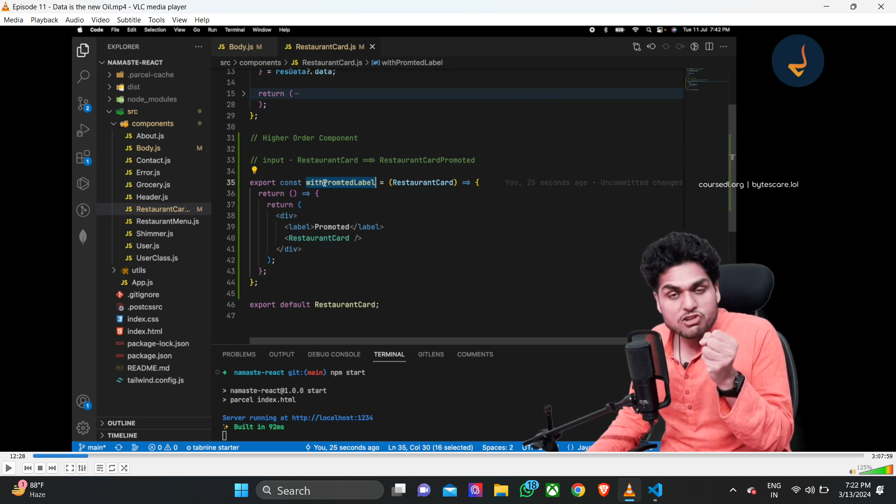
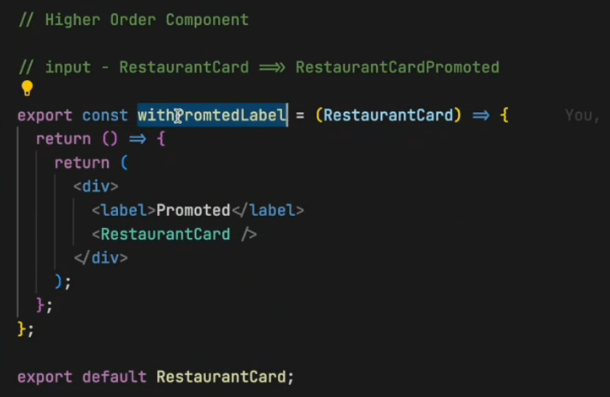
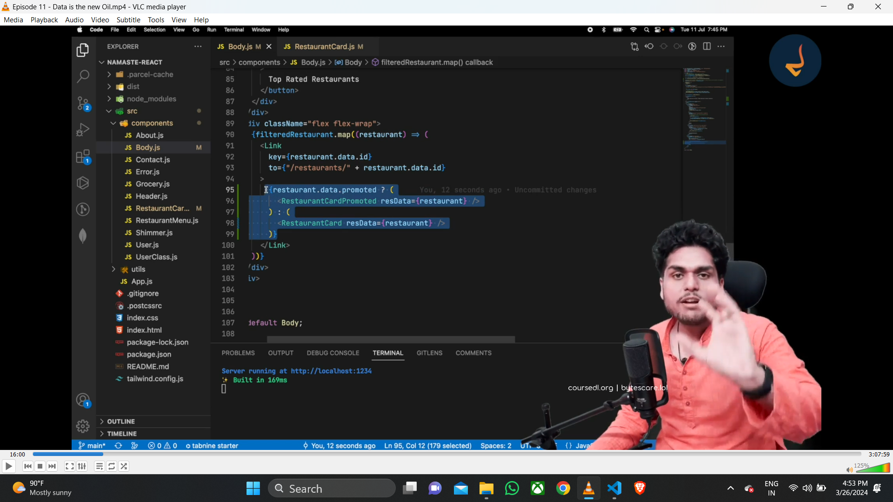
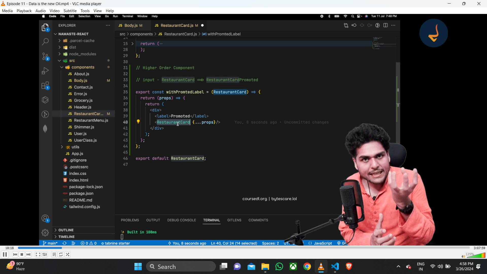
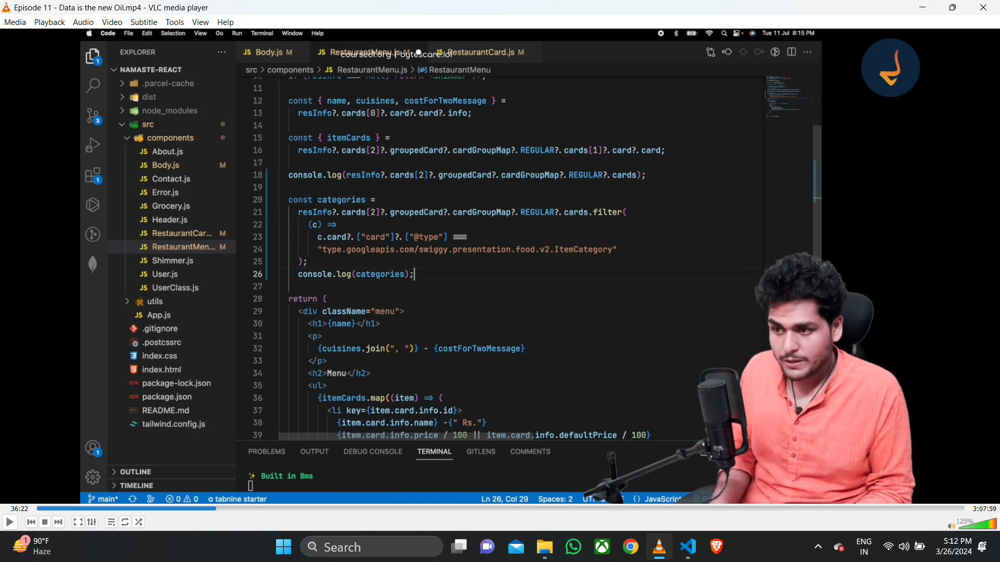
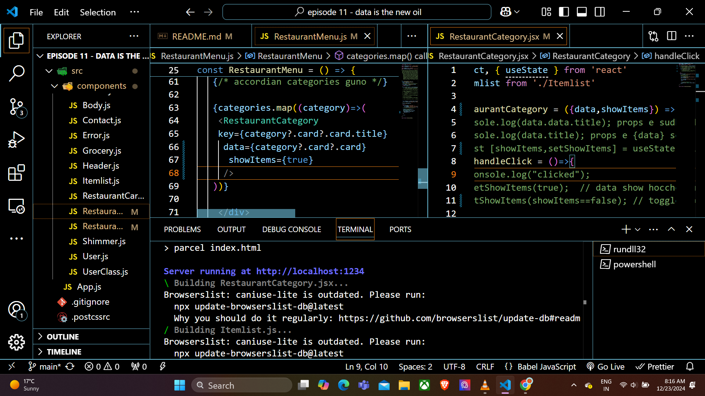
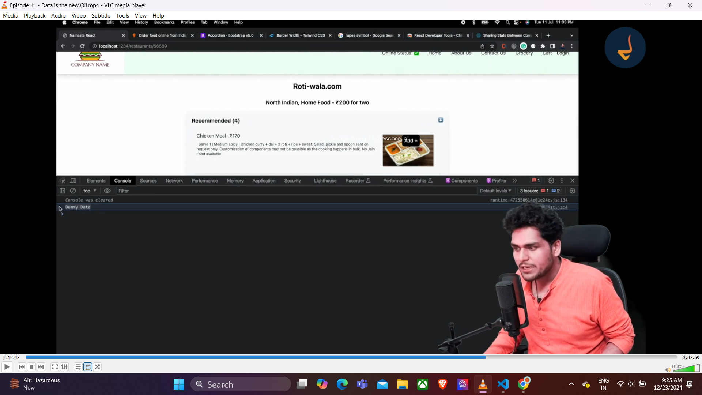

1. Higher order components

So basically higher order component is a function which takes A component as an input and. it enhances that component and provides that enhanced component as output
In this project I'm going to use the promoted tag that has been provided to the restaurant cards, as we can see in the swiggy website. So as we face. the data from Swiggy, there is an option as promoted which is providing us Boolean value. So according to that Boolean value, we will create a label tag and in that label tag we will write promoted for the cards which is promoted. Now we will create a higher order component in the restaurant. cards page such that that component higher order component will take the restoring card as the input it will enhance it and the enhancing is like it will just add a level on top and then it will again provide us the restaurant card and and and this enhance component is the output that we will use in the body component. whenever the any restaurant is giving us the Boolean value of promoted. So basically if I sum it up higher order function is nothing but of higher order component is nothing but a function which takes input t in the form of a component and provides output with that component with some enhance or extra features.

react -> 2 layers
data layer and ui layer
data layer is powering the ui layer
ui layer ta sudhui jsx that is malta 

individual restaurant pg r accordian r design take complete korlam

individual restaurant pg r accordian r logic take complete korlam
creating our own accordian using the toggle feature 

react dev tools 
components + timeline feature of react dev tools dekhlam
we can use this to make our appn better

now we are trying create a feature  that jokhun amara ekta accordian khulbo
baki accordian gulo collapse/bondho hoye jabe
eta tough as sob kota alada category r nijesso state ache

recommonded category r itemlist r control recommonded r kache ache
serom ei newly launced category r itemlist r control newly r kachei ache
ebar newly jane o na recommnded r state r bepare aar khule naki collapse hoye ache kichui janena
eibar amra chaichi je bhai recommonded khulle baki category guno jeno collapsee hoye jaaye
tarmane we want this state to be lifted up
so i dont want je recommonded category r power jeno recommonded r kache thake
power ta ami recommonded r baap ke dite chai 
baap bolbe showitems korbe kina

restaurant menu baap restaurant category r
so restaurant menu bolbe show korte jokhun ei tokhun ei restaurant category show korbe 
noile korbe na

so restaurant category r nijesso state thakbe na

controlled component = no nijesso state, baap control korche baccha ke 

uncontrolled component =  nijesso state +  baap control korche na baccha ke 

showItems={index===0 && true} --> prothom accordion ta khulbe baki guno bondho thakbe

eibar ami chaichi je 
ekta particular res ctg te click hole jeno sudhu seitar ei mal mosla display hoye

so amra jehetu controlled component niye khelchi
tai amra ekta state variable banachi parent component e
const[showIndex,setShowIndex] = useState(0);
showItems={index===showIndex ? true : false}

index = 0 hole oi particular res r first ctg ta show hobe

eibar amra chai konobhabe amra jodi ekta particular res ctg te click kori
sei particular res ctg ta jate show hoye

that means we want to change the value of setShowIndex whenever we click a different res ctg as a result index jokhun oi particular res ctg r sathe same hobe tokhun show hobe items gulo oi res ctg

but how can we change the value of setShowIndex oita toh sudhu baccha component tai parbe as baccha component tai screen e render hocche

now qs is baccha component baap r state ke change korte parbe?
ans -  directly na , but indirectly ha

ki kore ?

baccha take oi setShowIndex prop hisabe pass kore bolbo change kore dis click korlei
const[showIndex,setShowIndex] = useState(null); --> 

setShowIndex={()=> setShowIndex(index)} --> setShowIndex take prop hisabe baccha ke send korchi as a fn

const RestaurantCategory = ({data,showItems,setShowIndex}) => { 
    const handleClick = ()=>{
      setShowIndex();
    }
}

so prothome showIndex r value jehetu null sob accordian ei collapsed thakbe

eibar setshowindex fn ta baccha take dicchi 
and suppose i am clicking on a accordian
so click korar por
oi particular accordian r index tar value ta
index=oi particular accordian r index tar value
showIndex = oi particular accordian r index tar value

duto jayega tei change hocche

aar value duto jehetu same tai oi particular accordian ta expand hocche aar bski sob accordian close hoye jaache

props drilling- sharing  data through components using props
kotha ta hocche je ekta react application e onek component thake
eibar suppose ami ekta data dadu component ke banachi aar chaichi nati sei data take screen e show korak
so eitar jonno dadu should give the data to nati
but dadu eita directly korte parbe  na
dadu ke prothome data take baba ke dite hobe tarpor baba oi data take baccha take pass korbe 

eibar problem ta hocche je bap toh data take use korlona bap data ta niye ki korbe
and react e data flow r direction ektai - top to bottom 
so eikhane jehetu dadu baap chele 2 to component r through te data pass hocche tai oto problem nei 
but ekta react r boro application e prochur component thake
so ekta particular component theke onno ekta component e data transfer kora bar bar props likhe likhe seita toh aar sombhob na 

to solve this particular problem react did gift us the react context 

