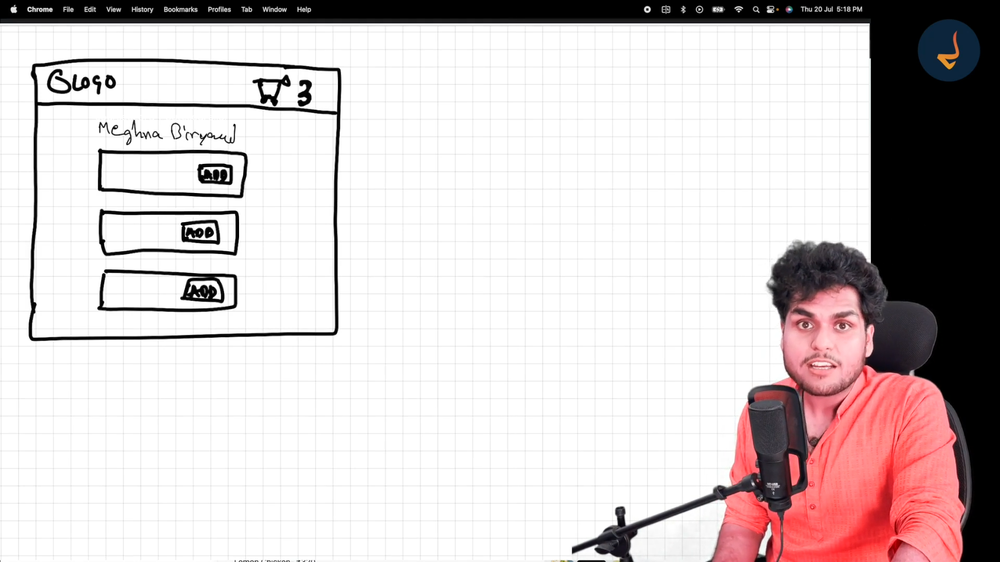
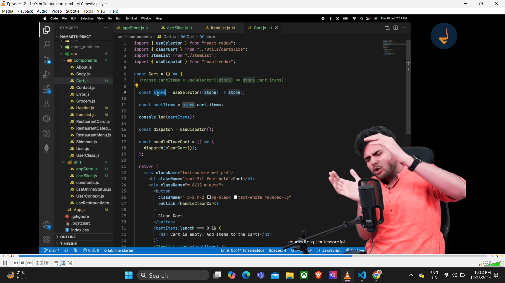

redux - dont depend heavily on redux
redux handles a lot of states and data
redux in data layer
react and redux are different
redux eases debugging
zustland o ache ekta 
redux offers state mngment so jekono framework libary r sathe cholbe
majorly use hoye react r sathe 

redux toolkit ebong react-redux use korbo eikhane
react redux hocche react aar redux r r majhe connrction toiri kora
redux toolkit  = rtk
  

  

  redux store = big js object with a lot of data inside it and it is kept in a global central space 
  react e jekono component ei store take access korte parbe

  amar nijer data ke most of the data ke eikhane store kore rakhi

  sob data eo eikhane rakha jaye
  redux r jate problem na hoye redux slices hisabe data tule rakhe

  
   now the card slice will have all the data of the cart

    prothome card slice empty thake tarpor card slice e amra data dhokai
jeta sohoj na

add to cart button tiple ki kore data ta card slice e dhoke?
directly data dhokano jaye na
ekta upay ache  amader

click on the add button --> dispatch an action now this will call a function
now thid fn will modify the cart

and this fn is known as the reducer function 

add button -> dispatch an action -> which calls the reducer function -> which updates the slice of the redux store

now how to read data 

now to read data we use selector 
and this phenomeonon is known as subscribing to the store

as we say header component is subscribed to a store
that means the data is sync with the store
so if the data changes inside the store the header component will update automatically

redux will automatically update the data inside the header component when the store changes
and how do you subscribe ?
using the selector.

flow for the last time --> 

#redux toolkit
 1. install @reduxjs/toolkit and react-redux
 using npm i 

 2. build our store  --> using configureStore
 const { configureStore } = require("@reduxjs/toolkit");
import cartReducer from "./cartSlice";

const appStore = configureStore({
    reducer:{  -> this reducer is the reducer for the whole store
        cart: cartReducer,     --> eita hocche store r ekta particular slice r reducer
        this is all about ei particular store e koto guno reducer ache alada alada seiguno eikhane lekh baba

    }
});

export default appStore;

 3. connect our store to our app  --> using Provider and props hisabe send korchi appStore ke
  <Provider store={appStore}>
  </Provider>

 4. slice(cartslice) --> we use createSlice to create our cart
but now createSlice is a object which has many things
const { createSlice } = require("@reduxjs/toolkit");

const cartSlice = createSlice({
    name: 'cart',    naam ache
    initialState: {     initial state ache obj eita
        items:[]
    },
    reducers: {       reducer fn ache obj eita
        addItem : (state,action) =>{
            state.items.push(action.payload);
        },
        removeItem : (state,action) => {
            state.items.pop();
        } ,
        clearCart: (state,action) => {
            state.items.length=0;

        },
    },
})

 5. dispatch(action)
export const {addItem,removeItem,clearCart} = cartSlice.actions;   ei particular actions guno ache 
export default cartSlice.reducer;  cartslice bole ekta slice r reducer eita &&  ei function gulo ache particular actions r jonno

 6. selector
 // subscribing to the store using a selector --> redux store r mal guno r data dekhte gele we need selector --> basically reading data
  const cartItems = useSelector((store)=>store.cart.items);

  console.log(cartItems);

  7. adding data now

const dispatch = useDispatch();

  const handleAddItem = (item) => {
    // dispatch an action -- adding item wala action
    dispatch(addItem(item));

  }
  <button className="bg-black text-white shadow-lg rounded-lg p-1 mx-20 "
 onClick={() => handleAddItem(item)}
             >
              Add +
            </button>

imp points for interview -

1. best use of useselector for better performance

we shouldnt subscribe to all the parts of the store
example login part of the store shouldnt be subscribed to the cart pg for this purpose

2. reducer and reducers
reducer is the big reducer fn which contains all the reducers of the slices of the store

and reducers are the containers of the small fns of a particular slice

immer.js is getting used by redux 
behind the scene
redux creating an new immutable state making changes to it and returning the new state
but eita bojha jacche na new redux e 
as dekhe lagche we are mutating the old state only

Here’s the difference between the three `onClick` examples you provided:

1.onClick={handleAddItem}

2.onClick={handleAddItem(item)}

3.onClick={() => handleAddItem(item)} 

### 1. `onClick={handleAddItem}`

- **Description**: This directly assigns the `handleAddItem` function as the event handler.
- **Behavior**: When the button is clicked, `handleAddItem` will execute. 
- **Use Case**: Use this when `handleAddItem` does not require any arguments.
- **Pitfall**: If `handleAddItem` expects arguments, it will throw an error since it receives the `click` event object by default.

---

### 2. `onClick={handleAddItem(item)}`

- **Description**: This **immediately invokes** `handleAddItem` with `item` when the component renders.
- **Behavior**: The function runs immediately as the component is rendered, not when the button is clicked.
- **Use Case**: Rarely used for event handlers, as it usually results in unintended behavior.
- **Pitfall**: You lose control over when the function executes—it executes during render, which is almost always undesired.

---

### 3. `onClick={() => handleAddItem(item)}`

- **Description**: This uses an arrow function to wrap `handleAddItem(item)`.
- **Behavior**: The arrow function is executed when the button is clicked, and it calls `handleAddItem(item)`.
- **Use Case**: Use this when `handleAddItem` requires arguments like `item`.
- **Pitfall**: Creates a new function on every render, which may slightly affect performance in large-scale applications (though negligible in most cases).

---

### Summary Table

| Syntax                     | Function Executed   | Runs During Render | Requires Arguments |
|----------------------------|---------------------|--------------------|--------------------|
| `onClick={handleAddItem}`  | `handleAddItem()`   | ❌                 | ❌                 |
| `onClick={handleAddItem(item)}` | `handleAddItem(item)` | ✅                 | ✅                 |
| `onClick={() => handleAddItem(item)}` | `handleAddItem(item)` | ❌                 | ✅                 |

### Best Practice
- Use **`onClick={handleAddItem}`** if no arguments are required.
- Use **`onClick={() => handleAddItem(item)}`** if you need to pass arguments.

