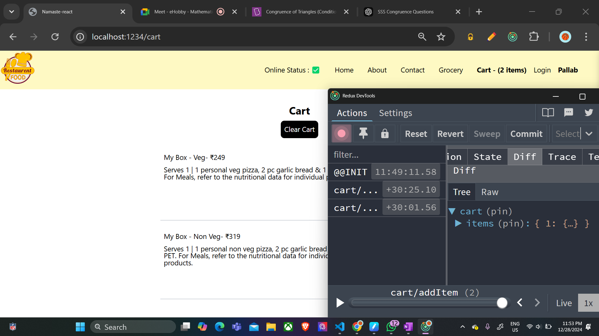

redux - dont depend heavily on redux
redux handles a lot of states and data
redux in data layer
react and redux are different
redux eases debugging
zustland o ache ekta 
redux offers state mngment so jekono framework libary r sathe cholbe
majorly use hoye react r sathe 

redux toolkit ebong react-redux use korbo eikhane
react redux hocche react aar redux r r majhe connrction toiri kora
redux toolkit  = rtk
  

  

  redux store = big js object with a lot of data inside it and it is kept in a global central space 
  react e jekono component ei store take access korte parbe

  amar nijer data ke most of the data ke eikhane store kore rakhi

  sob data eo eikhane rakha jaye
  redux r jate problem na hoye redux slices hisabe data tule rakhe

  
   now the card slice will have all the data of the cart

    prothome card slice empty thake tarpor card slice e amra data dhokai
jeta sohoj na

add to cart button tiple ki kore data ta card slice e dhoke?
directly data dhokano jaye na
ekta upay ache  amader

click on the add button --> dispatch an action now this will call a function
now thid fn will modify the cart


and this fn is known as the reducer function 


add button -> dispatch an action -> which calls the reducer function -> which updates the slice of the redux store

now how to read data 


now to read data we use selector 
and this phenomeonon is known as subscribing to the store

as we say header component is subscribed to a store
that means the data is sync with the store
so if the data changes inside the store the header component will update automatically

redux will automatically update the data inside the header component when the store changes
and how do you subscribe ?
using the selector.

flow for the last time --> 

#redux toolkit
 1. install @reduxjs/toolkit and react-redux
 using npm i 

 2. build our store  --> using configureStore
 const { configureStore } = require("@reduxjs/toolkit");
import cartReducer from "./cartSlice";

const appStore = configureStore({
    reducer:{  -> this reducer is the reducer for the whole store
        cart: cartReducer,     --> eita hocche store r ekta particular slice r reducer
        this is all about ei particular store e koto guno reducer ache alada alada seiguno eikhane lekh baba

    }
});

export default appStore;

 3. connect our store to our app  --> using Provider and props hisabe send korchi appStore ke
  <Provider store={appStore}>
  </Provider>

 4. slice(cartslice) --> we use createSlice to create our cart
but now createSlice is a object which has many things
const { createSlice } = require("@reduxjs/toolkit");


const cartSlice = createSlice({
    name: 'cart',    naam ache
    initialState: {     initial state ache obj eita
        items:[]
    },
    reducers: {       reducer fn ache obj eita
        addItem : (state,action) =>{
            state.items.push(action.payload);
        },
        removeItem : (state,action) => {
            state.items.pop();
        } ,
        clearCart: (state,action) => {
            state.items.length=0;

        },
    },
})

 5. dispatch(action)
export const {addItem,removeItem,clearCart} = cartSlice.actions;   ei particular actions guno ache 
export default cartSlice.reducer;  cartslice bole ekta slice r reducer eita &&  ei function gulo ache particular actions r jonno


 6. selector
 // subscribing to the store using a selector --> redux store r mal guno r data dekhte gele we need selector --> basically reading data
  const cartItems = useSelector((store)=>store.cart.items);

  console.log(cartItems);


  7. adding data now

const dispatch = useDispatch();

  const handleAddItem = (item) => {
    // dispatch an action -- adding item wala action
    dispatch(addItem(item));

  }
  <button className="bg-black text-white shadow-lg rounded-lg p-1 mx-20 "
 onClick={() => handleAddItem(item)}
             >
              Add +
            </button>


imp points for interview -

1. best use of useselector for better performance

we shouldnt subscribe to all the parts of the store
example login part of the store shouldnt be subscribed to the cart pg for this purpose

2. reducer and reducers
reducer is the big reducer fn which contains all the reducers of the slices of the store

and reducers are the containers of the small fns of a particular slice


immer.js is getting used by redux 
behind the scene
redux creating an new immutable state making changes to it and returning the new state
but eita bojha jacche na new redux e 
as dekhe lagche we are mutating the old state only


redux dev tools


footer add korlam 
ektu home  pg customize korlam
now going to deploy it using netlify
https://pb7-restaurant.netlify.app/


Here’s the difference between the three `onClick` examples you provided:

1.onClick={handleAddItem}

2.onClick={handleAddItem(item)}

3.onClick={() => handleAddItem(item)} 


### 1. `onClick={handleAddItem}`

- **Description**: This directly assigns the `handleAddItem` function as the event handler.
- **Behavior**: When the button is clicked, `handleAddItem` will execute. 
- **Use Case**: Use this when `handleAddItem` does not require any arguments.
- **Pitfall**: If `handleAddItem` expects arguments, it will throw an error since it receives the `click` event object by default.

---

### 2. `onClick={handleAddItem(item)}`

- **Description**: This **immediately invokes** `handleAddItem` with `item` when the component renders.
- **Behavior**: The function runs immediately as the component is rendered, not when the button is clicked.
- **Use Case**: Rarely used for event handlers, as it usually results in unintended behavior.
- **Pitfall**: You lose control over when the function executes—it executes during render, which is almost always undesired.

---

### 3. `onClick={() => handleAddItem(item)}`

- **Description**: This uses an arrow function to wrap `handleAddItem(item)`.
- **Behavior**: The arrow function is executed when the button is clicked, and it calls `handleAddItem(item)`.
- **Use Case**: Use this when `handleAddItem` requires arguments like `item`.
- **Pitfall**: Creates a new function on every render, which may slightly affect performance in large-scale applications (though negligible in most cases).

---

### Summary Table

| Syntax                     | Function Executed   | Runs During Render | Requires Arguments |
|----------------------------|---------------------|--------------------|--------------------|
| `onClick={handleAddItem}`  | `handleAddItem()`   | ❌                 | ❌                 |
| `onClick={handleAddItem(item)}` | `handleAddItem(item)` | ✅                 | ✅                 |
| `onClick={() => handleAddItem(item)}` | `handleAddItem(item)` | ❌                 | ✅                 |

### Best Practice
- Use **`onClick={handleAddItem}`** if no arguments are required.
- Use **`onClick={() => handleAddItem(item)}`** if you need to pass arguments.


### cors error after deployment

const fetchData = async () => {
  try {
    // Send a POST request to the CORS proxy
    const data = await fetch("https://handler-cors.vercel.app/fetch", {
      method: "POST",
      headers: {
        "Content-Type": "application/json",
      },
      body: JSON.stringify({
        url: "https://www.swiggy.com/dapi/restaurants/list/v5?lat=12.9351929&lng=77.62448069999999&is-seo-homepage-enabled=true&page_type=DESKTOP_WEB_LISTING",
      }),
    });

    // Handle any errors from the proxy
    if (!data.ok) {
      throw new Error(`Error: ${data.status} ${data.statusText}`);
    }

    // Parse the JSON response from the proxy
    const json = await data.json();
    console.log("Raw JSON:", json);

    // Extract and set the restaurant data
    const restaurants =
      json?.data?.cards[4]?.card?.card?.gridElements?.infoWithStyle?.restaurants || [];

    setListOfRestaurants(restaurants);
    setfilteredlistOfRestaurants(restaurants);
  } catch (error) {
    console.error("Error fetching data:", error);
  }
};


Sure! Let’s go step by step to fully understand what’s happening in your context and why the **POST request** is being used with a CORS proxy.

---

### **1. What is CORS?**
**CORS** stands for **Cross-Origin Resource Sharing**. It’s a security feature implemented in browsers to restrict how resources on a web page (from one domain) can interact with resources from another domain.

#### **Example:**
- Your web application is hosted on `http://myapp.com`.
- You want to fetch data from `https://swiggy.com/api`.

By default, the browser will **block** this request because the origin (your app’s domain) is different from the Swiggy API’s domain. This is a **CORS restriction**.

#### Why does this happen?
CORS is designed to protect users from malicious websites that try to fetch sensitive data (like banking information) from other origins without their permission.

---

### **2. Why Do You Need a Proxy?**
A **CORS proxy** acts as an intermediary between your web application and the API. Here’s how it works:
1. Your app sends a request to the **CORS proxy** (in this case, `https://handler-cors.vercel.app/fetch`).
2. The proxy forwards the request to the target API (e.g., Swiggy’s API) on your behalf.
3. The API responds to the proxy, and the proxy sends the response back to your app.

Since the proxy and your app are on the **same origin**, the browser doesn’t block the response.

---

### **3. How is the POST Request Used in This Context?**
Here’s what happens in your code:

#### Step-by-Step Explanation:
1. **Your App Sends a POST Request to the Proxy**:
   ```javascript
   fetch("https://handler-cors.vercel.app/fetch", {
     method: "POST",
     headers: {
       "Content-Type": "application/json",
     },
     body: JSON.stringify({
       url: "https://www.swiggy.com/dapi/restaurants/list/v5?lat=12.9351929&lng=77.62448069999999&is-seo-homepage-enabled=true&page_type=DESKTOP_WEB_LISTING",
     }),
   });
   ```
   - The `url` in the request body is the actual Swiggy API endpoint.
   - Your app is asking the proxy to fetch data from Swiggy’s API.

2. **Proxy Forwards the Request**:
   - The proxy (`https://handler-cors.vercel.app/fetch`) reads the URL from the request body.
   - It sends a GET request to Swiggy’s API on your behalf.
   - Since the proxy isn’t restricted by CORS (it’s a server, not a browser), it successfully gets the data.

3. **Proxy Sends the Data Back to Your App**:
   - The proxy receives the data from Swiggy’s API.
   - It sends this data as a response to your app’s POST request.

4. **Your App Handles the Response**:
   - Once the proxy sends the response back, your app processes it, extracts the restaurant data, and updates the UI.

---

### **4. Why Use a POST Request for the Proxy?**
The proxy expects a **POST request** because:
- **Flexible Input**: The Swiggy API URL is sent in the request body, making it easier to handle complex parameters.
- **Security**: The URL isn’t exposed in the query string (as it would be in a GET request), reducing the risk of accidental logging or exposure.
- **CORS Proxy Design**: The proxy server may have been designed to process incoming POST requests specifically for fetching external data.

---

### **5. Benefits of Using a CORS Proxy**
- **Bypasses CORS Restrictions**: The proxy server acts as a middleman, so your browser no longer faces CORS issues.
- **Simplifies Frontend Logic**: Your frontend doesn’t need to handle CORS headers or manage cross-origin requests directly.
- **Secure Communication**: Sensitive API endpoints can be hidden behind the proxy.

---

### **6. Visual Representation**
Here’s a simplified flow of what’s happening:

#### Without Proxy (Blocked):
```
Your App (Frontend) ---> Swiggy API (CORS Error: Blocked by Browser)
```

#### With Proxy:
```
Your App (Frontend)
      |
      v
CORS Proxy (https://handler-cors.vercel.app/fetch)
      |
      v
Swiggy API ---> Proxy ---> Your App (Data Successfully Retrieved)
```

---

### **7. Practical Explanation of Your Code**
Here’s what your specific function is doing:
```javascript
const fetchData = async () => {
  try {
    // Send a POST request to the CORS proxy
    const data = await fetch("https://handler-cors.vercel.app/fetch", {
      method: "POST",
      headers: {
        "Content-Type": "application/json",
      },
      body: JSON.stringify({
        url: "https://www.swiggy.com/dapi/restaurants/list/v5?lat=12.9351929&lng=77.62448069999999&is-seo-homepage-enabled=true&page_type=DESKTOP_WEB_LISTING",
      }),
    });

    // Handle any errors from the proxy
    if (!data.ok) {
      throw new Error(`Error: ${data.status} ${data.statusText}`);
    }

    // Parse the JSON response from the proxy
    const json = await data.json();
    console.log("Raw JSON:", json);

    // Extract and set the restaurant data
    const restaurants =
      json?.data?.cards[4]?.card?.card?.gridElements?.infoWithStyle?.restaurants || [];

    setListOfRestaurants(restaurants);
    setfilteredlistOfRestaurants(restaurants);
  } catch (error) {
    console.error("Error fetching data:", error);
  }
};
```

---

### **8. Key Takeaways**
- The **POST request** sends the Swiggy API URL to the CORS proxy.
- The **proxy** fetches the data from Swiggy’s API and returns it to your app.
- The proxy enables your app to access data without facing CORS restrictions.
- This setup is common for APIs that don’t support direct client-side access.


https://pb7-restaurant.netlify.app/  --> deployed link

lets see if it works in others devices 