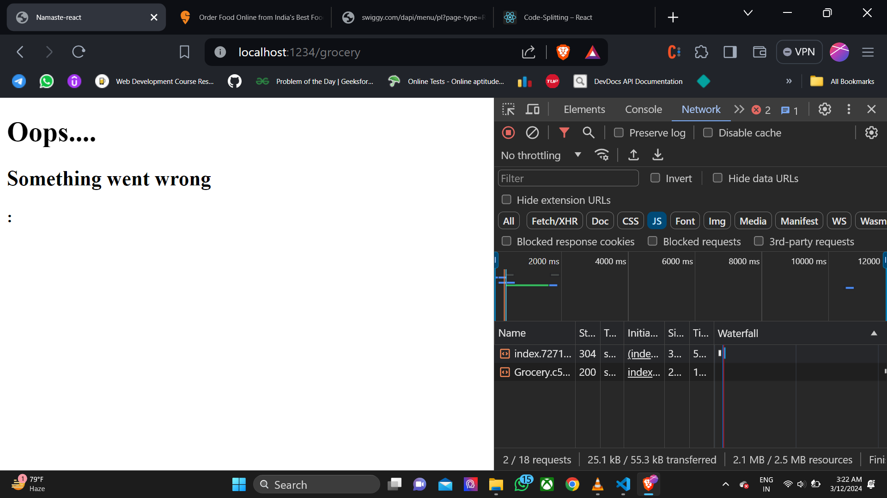
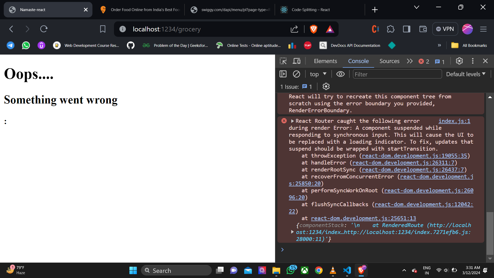
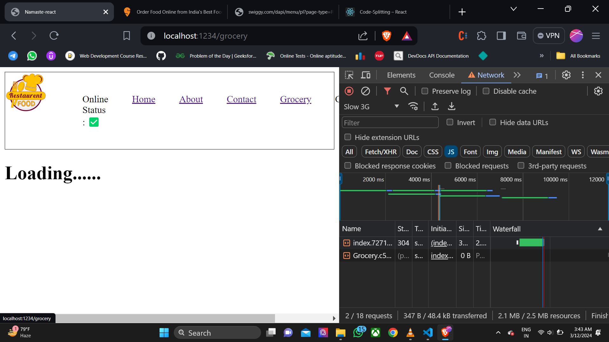
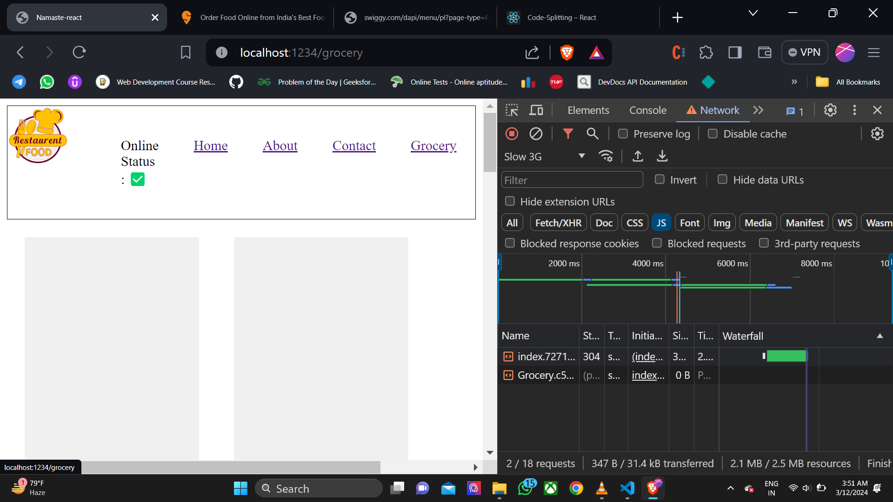

## Namaste React Course by Akshay Saini

# Episode 09 - Optimizing Our App

## Theory

### Topics Taught

- Custom Hooks
- Modularity in Code
- Modular Bundling
- Code Splitting
- Lazy Loading

## Namaste React Course by Akshay Saini

# Episode 09 - Optimizing our App

## Theory Assignment:

- When and why do we need `lazy()`?
- What is `suspense`?
- Why we got this `error`: A component was suspended while responding to `synchronous input`. This will cause the `UI` to be replaced with a `loading indicator`. To `fix this`, `updates that suspend` should be wrapped with `start transition`? How does `suspense fix` this error?
- `Advantages and Disadvantages` of using this `code splitting pattern`?
- When `do we and why do we need suspense`?

## Coding Assignment:

- Create your `custom hooks`.
- Try out `lazy and suspense`
- Make your `code clean`.

## References:

- [React Custom Hooks](https://reactjs.org/docs/hooks-custom.html)
- [React lazy](https://react.dev/reference/react/lazy#suspense-for-code-splitting)

/*
Akshay saini is teaching us the purpose of single responsibility principle that states that as every component is a function so the component should have only one purpose of serving the application that means that by following this principle we should have we should have the test cases passing smoothly such that only one component has a single function we can define as many test test cases for such component and such that when we are actually trying to find a error in the particular application the where the particular error is coming from can be detected by that particular component error that's why we should follow this we should follow this principle of single responsibility and also this principle gives us the familiarity of modularity which states that we can use this component anytime we want to and the second thing the third thing along with this testing and modularity is the case of finding bugs like if I say right now that the application is made of components which are linked together then even if the bugs are right in front of me then I have to search in all the components to find the bugs present in the application so this single responsibility help us to find the bug in the which is coming from the particular component
So our code becomes reusable maintainable as well as testable When we use the single responsibility function purpose
So now Sir will teach us the component that is not following. single. responsibility function. which we can optimize. by writing our own custom hooks.

custom hook without use o lekha jaye
but it is a ggod practice to write use before any custom hook.

important for system design frontend interview
whenever we develop a large scale appn consisting of 1000+ components performance is low
to improve this what we need is ?
kotha ta hocche je jehetu parcel react r sob kota ke ek jayega te joro kore 
just ekta file index.js r modhe sob kota code rekhe oi file take screen e render kore tai jonno
ebar ki hocche joto component barbe toto ei index.js file r size barbe
ebar development build e size 2mb thakle production build e size aro kombe.
ekta  1000 ta component wala appn e onek kota bundler thake 
bundler hocche basically onek kota code ke ekjayega kore 
toh amra jodi just ekta bundler na rekhe 
onek kota bundler e benge di 
logical fn unujai
tahole aar ekta single index.js file thakche na onek kota file thakbe
tahole load porbe na ekta file r opor tai jonno api call slow hobe na 
such that performance better hobe
this process is known as chunking or code -spliting or dynamic bundling or dynmanic importing.
breaking down appn into smaller chunks

now creating a grocery component
suppose amader appn grocery o sell kore such that grocery page consists of many child components

ebar hocche ta hooche je index.js file in network tab e  under e ei grocery r code ta ache

eita amra chaina 

so we will apply lazy loading or on-demand loading === jokhun appn ta load hobe initially home screen e ei tokhun ei  grocery r code ta load hobena
grocery r code ta tokhun ei load hobe jokhun amra grocery r page e jabo. eijonnoi on-demand loading o bola hoye ei method take.

but we wont import grocery like this
import Grocery from "./components/Grocery";

we will use lazy fn

const Grocery = lazy()

this lazy() fn is a fn coming from react as a named import so

import {lazy} from "react";

now this lazy() fn takes one paramter/argument which is a callback fn
i.e.
lazy(()=>{})

and this callback fn takes a fn import() and this import fn asks for the location where the component is stored/placed.
now lets apply  this all together.
const Grocery = lazy(()=> import("./components/Grocery"));

ebar kotha ta hocche  we are getting this error 
why  this error ?
prothome jokhun amra home pg take khulchi ei grocery r code index.js e file e nei
tarpor jokhun amra grocery r pg tate jacchi tokhun jehetu grocery r code ta  react khuje pacche na tai react ei error ta dicche
basically prothome home pg e jokhun amra achi
tarpor amra grocery pg e jacchi 
aar grocery pg load hote suppose 15ms dekhache amar browser e 
so react jehetu ei 15ms time r modhe grocery r code ta khuje pacche na tai error dicche
now how to solve this error ?
just use suspense fn jeita react amader ke provide kore
suspense fn r modhe wrap up/dhukiye dao ei grocery component take

suspense fn r kaj ki ?
ei je 15ms react grocery code khuje na peye error dicchilo
ebar react jotokhun ei grocery r code ta pabe 
totokhun grocery r modhe je fallback code ta thakbe seita screen e show korbe instead of error
code-

(
          <Suspense fallback={<h1>Loading......</h1>}>
            <Grocery />
          </Suspense>
        )

        fallback={<h1>Loading......</h1>} ei fallback fn ta value hisabe sudhu jsx e neye so hw is try it with a different shimmer ui type
        
        code-
        (
          <Suspense fallback={Shimmer()}>
            <Grocery />
          </Suspense>
        )
        

*/